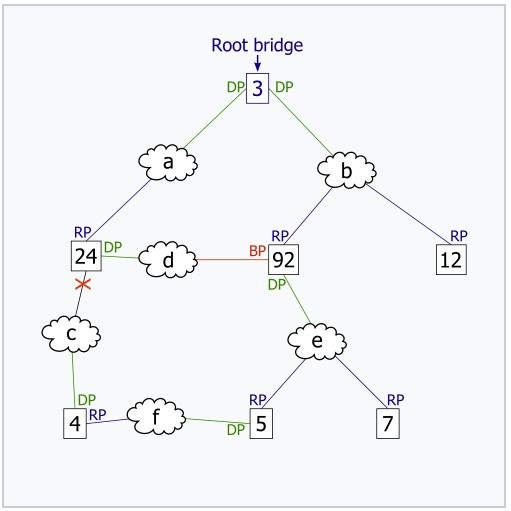
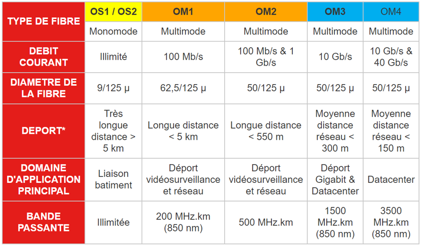

# Training Networks July 24th and 25th 2024


# TP : Découverte de l'encapsulation des protocoles avec Wireshark

#### Objectifs pédagogiques
>[!NOTE]
>- Comprendre le concept d'encapsulation des protocoles dans le modèle OSI.
>- Identifier et analyser les différents niveaux de protocoles (Ethernet, IP, ICMP, TCP, UDP, HTTP, HTTPS) dans une capture de trafic réseau.
>- Utiliser Wireshark pour capturer et examiner des paquets réseau.

#### Pré-requis
>[!TIP]
>- Installation de Wireshark sur les ordinateurs.
>- Connaissance de base du modèle OSI et des principaux protocoles réseau.

#### Matériel nécessaire
- Ordinateurs avec Wireshark installé.
- Connexion Internet pour générer du trafic HTTP/HTTPS.

#### Durée
- 45 minutes.

### Étapes du TP

#### Partie 1 : Introduction et préparation (15 minutes)

1. **Présentation de Wireshark :**
   - Expliquez brièvement l'outil Wireshark et ses fonctionnalités principales.
   - Montrez comment sélectionner une interface réseau pour capturer du trafic.

2. **Préparation à la capture :**
   - Démarrez Wireshark et sélectionnez l'interface réseau active (Wi-Fi ou Ethernet).
   - Cliquez sur "Start" pour commencer la capture de trafic.

#### Partie 2 : Capture de trafic réseau (15 minutes)


*d'après Wikipedia*

1. **Générer du trafic HTTP/HTTPS :**
   - Ouvrez un navigateur web et visitez plusieurs sites web pour générer du trafic HTTP et HTTPS.

2. **Générer du trafic ICMP :**
   - Ouvrez un terminal ou l'invite de commandes et exécutez la commande `ping www.google.com`.

3. **Générer du trafic TCP/UDP :**
   - Utilisez des applications ou services connus pour utiliser des connexions TCP et UDP, comme le téléchargement d'un fichier ou le streaming de vidéos (Voir l'outil NetworkStuff)

4. **Arrêter la capture :**
   - Revenez à Wireshark et cliquez sur le bouton "Stop" pour arrêter la capture de trafic.

#### Partie 3 : Analyse de la capture (50 minutes)

1. **Filtrage des paquets :**
>[!TIP]
>   - Utilisez les filtres suivants pour isoler les différents types de trafic :
>     - Ethernet : `eth`
>     - IP : `ip`
>     - ICMP : `icmp`
>     - TCP : `tcp`
>     - UDP : `udp`
>     - HTTP : `http`
>     - HTTPS : `tls`

2. **Examiner les paquets Ethernet :**
   - Appliquez le filtre `eth` et sélectionnez un paquet.
   - Notez les adresses MAC source et destination, ainsi que le type de protocole.
   - Tester avec un filtre : eth.src == [adresse MAC].

3. **Examiner les paquets IP :**
   - Appliquez le filtre `ip` et sélectionnez un paquet.
   - Notez les adresses IP source et destination, et le champ Protocole.
   - Tester avec un filtre et une condition : ip and eth.dst==[adresse MAC].  
4. **Examiner les paquets ICMP :**
   - Appliquez le filtre `icmp` et sélectionnez un paquet.
   - Notez le type et le code ICMP.

5. **Examiner les paquets TCP :**
   - Appliquez le filtre `tcp` et sélectionnez un paquet.
   - Notez les ports source et destination, les numéros de séquence et d'accusé de réception.

6. **Examiner les paquets UDP :**
   - Appliquez le filtre `udp` et sélectionnez un paquet.
   - Notez les ports source et destination.

7. **Examiner les paquets HTTP :**
   - Appliquez le filtre `http` et sélectionnez un paquet.
   - Notez la méthode HTTP, l'URL, et le statut de la réponse.

8. **Examiner les paquets HTTPS :**
   - Appliquez le filtre `tls` et sélectionnez un paquet.
   - Notez les informations disponibles malgré le chiffrement (ex. la négociation TLS).

#### Partie 4 : Discussion et conclusion (10 minutes)

1. **Discussion en groupe :**
>[!TIP]
>   - Discutez des observations faites pendant l'analyse.
>   - Mettez en évidence comment chaque couche encapsule les données de la couche supérieure.

2. **Questions et réponses :**

3. **Conclusion :**
   - Récapitulez les points clés de l'activité.
   - Soulignez l'importance de l'encapsulation et des différentes couches de protocoles.

### Masques Réseaux en IPv4 et Notation CIDR: Synthèse

#### Introduction
>[!NOTE]
>Les masques réseaux et la notation CIDR (Classless Inter-Domain Routing) sont essentiels pour la gestion et la structuration des réseaux IP. Ils permettent de segmenter les réseaux en sous-réseaux et de gérer efficacement l'adressage IP.

#### Masques Réseaux en IPv4
>[!NOTE]
>Un **masque réseau** est une séquence de 32 bits utilisée pour diviser une adresse IP en deux parties: l'adresse du réseau et l'adresse de l'hôte. Il est souvent représenté sous forme de quatre octets décimaux, par exemple, `255.255.255.0`.

- **Fonctionnement**: 
  - Les bits à `1` dans le masque réseau désignent la partie réseau de l'adresse IP.
  - Les bits à `0` désignent la partie hôte.

**Exemple**:
Pour l'adresse IP `192.168.1.10` avec un masque réseau `255.255.255.0`:
- Partie réseau: `192.168.1`
- Partie hôte: `10`

#### Classes d'Adresses IP et Masques Réseaux
Historiquement, les adresses IPv4 étaient divisées en classes (A, B, C, D, E), chaque classe ayant un masque réseau par défaut:
- **Classe A**: `255.0.0.0`
- **Classe B**: `255.255.0.0`
- **Classe C**: `255.255.255.0`

#### Notation CIDR (Classless Inter-Domain Routing)
La **notation CIDR** est une méthode plus flexible pour représenter les réseaux et sous-réseaux. Elle utilise une adresse IP suivie d'un slash (/) et du nombre de bits `1` dans le masque réseau.

- **Exemple de Notation CIDR**:
  - `192.168.1.0/24` signifie que les 24 premiers bits de l'adresse IP sont utilisés pour la partie réseau, équivalent au masque `255.255.255.0`.

#### Avantages de la Notation CIDR
- **Flexibilité**: Permet de créer des sous-réseaux de taille variable, optimisant ainsi l'utilisation des adresses IP.
- **Efficacité**: Réduit le gaspillage d'adresses IP en permettant une allocation plus précise.

#### Conversion entre Notation CIDR et Masques Réseaux
- `255.0.0.0` = `/8`
- `255.255.0.0` = `/16`
- `255.255.255.0` = `/24`
- `255.255.255.128` = `/25`

#### Exemple d'Utilisation de la Notation CIDR
1. **Division d'un Réseau en Sous-Réseaux**:
   - Réseau: `192.168.1.0/24`
   - Sous-réseaux possibles:
     - `192.168.1.0/26` (64 adresses)
     - `192.168.1.64/26` (64 adresses)
     - `192.168.1.128/26` (64 adresses)
     - `192.168.1.192/26` (64 adresses)

2. **Routeur et CIDR**:
   - Un routeur peut être configuré pour acheminer des paquets vers des sous-réseaux spécifiques en utilisant la notation CIDR pour réduire les entrées de routage.

#### Conclusion
>[!NOTE]
>Les masques réseaux et la notation CIDR sont des outils puissants pour la gestion des adresses IP dans un réseau. La transition vers la notation CIDR a permis une utilisation plus efficiente des adresses IP et une meilleure flexibilité dans la création et la gestion des sous-réseaux, facilitant ainsi la scalabilité et l'organisation des réseaux modernes.

### Synthèse sur les Adresses IPv4 Privées pour les Classes A, B et C

#### Introduction
>[!NOTE]
Les adresses IP privées sont utilisées au sein des réseaux locaux (LAN) pour permettre la communication entre les appareils sans nécessiter une adresse IP publique unique pour chaque appareil. Ces adresses ne sont pas routables sur l'internet public, ce qui améliore la sécurité et permet une réutilisation efficace des adresses IP. Les plages d'adresses IPv4 privées sont définies par la RFC 1918.

#### Plages d'Adresses IPv4 Privées

1. **Classe A**:
>[!TIP]
>   - **Plage d'adresses**: `10.0.0.0` à `10.255.255.255`
>   - **Masque par défaut**: `255.0.0.0` (notation CIDR: `/8`)
>   - **Nombre d'adresses disponibles**: 16 777 216 adresses (2^24)
>   - **Utilisation typique**: Idéale pour les très grands réseaux, tels que les campus universitaires ou les entreprises avec plusieurs sites.

2. **Classe B**:
>[!TIP]
>   - **Plage d'adresses**: `172.16.0.0` à `172.31.255.255`
>   - **Masque par défaut**: `255.240.0.0` (notation CIDR: `/12`)
>   - **Nombre d'adresses disponibles**: 1 048 576 adresses (2^20)
>   - **Utilisation typique**: Convient aux réseaux de taille moyenne à grande, >tels que les réseaux d'entreprise multi-sites.

3. **Classe C**:
>[!TIP]
>   - **Plage d'adresses**: `192.168.0.0` à `192.168.255.255`
>   - **Masque par défaut**: `255.255.255.0` (notation CIDR: `/24`)
>   - **Nombre d'adresses disponibles**: 65 536 adresses (2^16)
>   - **Utilisation typique**: Idéale pour les petits réseaux, tels que les réseaux domestiques ou les petites entreprises.

#### Caractéristiques et Avantages des Adresses Privées

- **Sécurité**: Les adresses privées ne sont pas routables sur l'internet public, ce qui protège les appareils locaux des accès directs depuis l'extérieur.
- **Économie d'adresses**: Permet de conserver les adresses IPv4 publiques en évitant de gaspiller des adresses uniques pour chaque appareil connecté à l'internet.
- **NAT (Network Address Translation)**: Les routeurs utilisent NAT pour permettre aux appareils avec des adresses IP privées de communiquer avec l'internet public via une adresse IP publique partagée.
- **Flexibilité**: Facilite la création de sous-réseaux et la gestion d'adresses IP au sein d'une organisation.

#### Exemple d'Utilisation

1. **Réseau Domestique**: 
   - Utilisation d'une plage d'adresses privées de Classe C, par exemple `192.168.1.0/24`, pour connecter des ordinateurs, des imprimantes, des smartphones, etc.
   - Le routeur utilise NAT pour permettre aux appareils de se connecter à l'internet avec une seule adresse IP publique.

2. **Réseau d'Entreprise**:
   - Utilisation d'une plage d'adresses privées de Classe B, par exemple `172.16.0.0/16`, pour un réseau multi-sites.
   - Les différentes sous-réseaux peuvent être créés à l'aide de sous-réseaux plus petits, par exemple `172.16.1.0/24`, `172.16.2.0/24`, etc.

3. **Campus Universitaire**:
   - Utilisation d'une plage d'adresses privées de Classe A, par exemple `10.0.0.0/8`, pour un campus avec des milliers d'appareils connectés.
   - Segmentation du réseau en plusieurs sous-réseaux pour une gestion et une organisation efficaces.

#### Conclusion
>[!NOTE]
>Les adresses IPv4 privées pour les classes A, B et C jouent un rôle crucial dans la gestion des réseaux internes, offrant sécurité, flexibilité et une utilisation efficace des adresses IP. Elles permettent aux organisations de tous types et de toutes tailles de structurer leurs réseaux de manière efficace, tout en conservant les adresses IP publiques pour les communications externes.

# ETHERNET

### Synthèse sur le Fonctionnement du Protocole Ethernet, les Adresses MAC et l'Encapsulation


#### Introduction
>[!NOTE]
**Ethernet** est une technologie de réseau largement utilisée pour les réseaux locaux (LAN). Il définit les règles et les normes pour la communication des données via des câbles physiques. Ethernet fonctionne au niveau 2 (couche liaison de données) du modèle OSI et utilise des adresses MAC pour identifier de manière unique chaque appareil sur un réseau.

#### Fonctionnement du Protocole Ethernet

1. **Trames Ethernet (Ethernet Frames)**:
>[!TIP]
>   - Les données sur un réseau Ethernet sont transmises sous forme de trames. Une trame Ethernet encapsule les données utilisateur avec des en-têtes et des champs de contrôle.
>   - **Structure d'une trame Ethernet**:
>     - **Préambule**: Séquence de 7 octets utilisée pour synchroniser les horloges des dispositifs de réception.
>     - **SFD (Start Frame Delimiter)**: Indique le début de la trame (1 octet).
>     - **Adresse MAC de destination**: 6 octets.
>     - **Adresse MAC source**: 6 octets.
>     - **Type/EtherType**: 2 octets, indique le protocole de couche supérieure encapsulé dans la trame.
>     - **Données**: Charge utile (46 à 1500 octets), contenant les données utilisateur et les en-têtes des couches supérieures.
>     - **FCS (Frame Check Sequence)**: 4 octets utilisés pour la détection d'erreurs.

2. **Transmission et Réception**:
   - **Envoi**: L'émetteur crée un cadre Ethernet avec les adresses MAC de destination et source, encapsule les données, et ajoute une FCS pour l'intégrité.
   - **Réception**: Le récepteur décode le cadre, vérifie la FCS pour l'intégrité, et extrait les données si l'adresse MAC de destination correspond à la sienne ou est une diffusion (broadcast).

#### Adresses MAC

1. **Définition**:
>[!NOTE]
>   - Une **adresse MAC (Media Access Control)** est une adresse physique unique assignée à chaque interface réseau. Elle est codée sur 48 bits (6 octets) et est généralement représentée sous forme hexadécimale (par exemple, `00:1A:2B:3C:4D:5E`).

2. **Structure**:
   - **OUI (Organizationally Unique Identifier)**: Les 24 premiers bits, identifiant le fabricant.
   - **NIC (Network Interface Controller)**: Les 24 derniers bits, identifiant de manière unique l'interface réseau au sein des dispositifs du fabricant.

3. **Types d'Adresses**:
   - **Unicast**: Adresse unique destinée à un seul dispositif.
   - **Broadcast**: Adresse de diffusion (`FF:FF:FF:FF:FF:FF`), destinée à tous les dispositifs sur le réseau local.
   - **Multicast**: Adresses destinées à un groupe spécifique de dispositifs.

#### Encapsulation

1. **Définition**:
>[!TIP] 
>  - **Encapsulation** est le processus d'ajouter des en-têtes et des informations de contrôle autour des données utilisateur à chaque couche du modèle OSI. Cela permet de transporter les données à travers les différents médias et protocoles du réseau.
>[!TIP]
>2. **Décapsulation**:
>   - À la réception, chaque couche décapsule les données en enlevant les en-têtes ajoutés par la couche correspondante à l'émetteur, jusqu'à ce que les données utilisateur soient récupérées.

#### Commandes Associées

1. **Affichage de l'Adresse MAC (sous Windows)**:
   - Commande:
     ```dos
     ipconfig /all
     ```
   - **Description**: Affiche la configuration IP de l'ensemble des interfaces réseau, y compris les adresses MAC.

2. **Affichage de l'Adresse MAC (sous Linux)**:
   - Commande:
     ```dos
     ip a
     ```
   - **Description**: Affiche la configuration IP de l'ensemble des interfaces réseau, y compris les adresses MAC.


#### Conclusion
>[!NOTE]
Le protocole Ethernet, avec ses adresses MAC uniques et son mécanisme d'encapsulation, permet une communication fiable et structurée entre les dispositifs connectés, tout en offrant des mécanismes robustes pour l'intégrité des données et la gestion des erreurs. Les concepts d'ARP, d'adresses MAC et d'encapsulation sont fondamentaux pour comprendre le fonctionnement et la gestion des réseaux Ethernet.

### Synthèse sur câbles Ethernet


### Synthèse sur le Fonctionnement d'ARP (Address Resolution Protocol)

#### Introduction
>[!NOTE]
L'**Address Resolution Protocol (ARP)** est un protocole crucial dans les réseaux IP, utilisé pour mapper les adresses IP (niveau 3 du modèle OSI) aux adresses MAC (niveau 2 du modèle OSI). Cela permet la communication sur les réseaux locaux (LAN).

#### Fonctionnement de l'ARP

1. **Résolution d'adresse**:
>[!TIP]
>   - Lorsqu'un appareil sur un réseau local souhaite communiquer avec un autre appareil, il doit connaître l'adresse MAC de l'appareil cible.
>   - Si l'adresse MAC n'est pas connue, l'appareil émetteur envoie une requête ARP sur le réseau. Cette requête est un message broadcast qui demande "Qui a l'adresse IP x.x.x.x ?"
>   - L'appareil possédant l'adresse IP demandée répond avec une réponse ARP, fournissant son adresse MAC.

2. **Requête ARP**:
   - **Broadcast**: La requête ARP est envoyée à tous les appareils sur le réseau local.
   - **Format**: Contient l'adresse IP de la destination et l'adresse MAC de l'émetteur.


3. **Réponse ARP**:
   - **Unicast**: La réponse est envoyée directement à l'appareil qui a émis la requête ARP.
   - **Format**: Contient l'adresse MAC correspondante à l'adresse IP demandée.


4. **Cache ARP**:
   - Pour éviter des requêtes ARP répétitives, les appareils stockent les correspondances IP-MAC dans un cache ARP.
   - Les entrées dans le cache ARP ont une durée de vie limitée pour s'assurer qu'elles restent à jour.

#### Commandes DOS Utilisant ARP

La commande `arp` sous DOS (ou Command Prompt sous Windows) permet d'interagir avec le cache ARP. Voici quelques exemples pratiques:

1. **Afficher le Cache ARP**:
   - Commande:
     ```dos
     arp -a
     ```
   - **Description**: Affiche les entrées actuelles du cache ARP. Vous pouvez voir les adresses IP et leurs adresses MAC correspondantes.

2. **Ajouter une Entrée ARP Statique**:
   - Commande:
     ```dos
     arp -s 192.168.1.1 00-aa-00-62-c6-09
     ```
   - **Description**: Ajoute une entrée statique au cache ARP, liant l'adresse IP `192.168.1.1` à l'adresse MAC `00-aa-00-62-c6-09`. Les entrées statiques ne sont pas supprimées automatiquement.

3. **Supprimer une Entrée ARP**:
   - Commande:
     ```dos
     arp -d 192.168.1.1
     ```
   - **Description**: Supprime l'entrée ARP pour l'adresse IP `192.168.1.1` du cache ARP (mode administrateur).

4. **Afficher les Options de la Commande ARP**:
   - Commande:
     ```dos
     arp -h
     ```
   - **Description**: Affiche l'aide et les options disponibles pour la commande `arp`.

#### Scénarios d'Utilisation de ARP

1. **Diagnostic Réseau**:
   - Utiliser `arp -a` pour vérifier les adresses MAC des appareils sur le réseau. Cela peut aider à diagnostiquer des problèmes de connectivité.

2. **Sécurité Réseau**:
   - Surveillance du cache ARP pour détecter des attaques de type ARP spoofing où un attaquant falsifie les réponses ARP pour rediriger le trafic.

3. **Administration Réseau**:
   - Configuration de tables ARP statiques pour des appareils critiques afin de prévenir les changements de correspondances IP-MAC et augmenter la sécurité.

#### Conclusion
>[!NOTE]
L'ARP est un protocole fondamental pour la communication sur les réseaux locaux, facilitant la correspondance entre les adresses IP et MAC. Les commandes DOS associées à ARP offrent des outils puissants pour gérer, diagnostiquer et sécuriser le cache ARP, aidant les administrateurs réseau à maintenir une infrastructure réseau fonctionnelle et sécurisée.

# VLAN

### Synthèse sur les VLAN
#### Définition
>[!NOTE]
Un VLAN (Virtual Local Area Network) est une technologie qui permet de segmenter un réseau physique en plusieurs réseaux logiques distincts. Les VLAN permettent de regrouper des périphériques réseau situés à des endroits différents comme s'ils faisaient partie du même réseau local.

#### Avantages
1. **Sécurité** : Les VLAN permettent de segmenter le trafic, limitant ainsi les possibilités d'accès non autorisé.
2. **Performance** : En réduisant le domaine de diffusion, les VLAN diminuent le trafic inutile et améliorent les performances du réseau.
3. **Flexibilité** : Les VLAN permettent une gestion plus souple des ressources réseau en facilitant l'ajout ou le déplacement de périphériques sans nécessiter de changements physiques.
4. **Gestion simplifiée** : Ils simplifient l'administration du réseau en regroupant les utilisateurs selon leurs fonctions ou leurs besoins de sécurité.

#### Fonctionnement
>[!TIP]
>- **Tagging** : Les VLAN utilisent des étiquettes (tags) pour identifier les trames appartenant à un VLAN spécifique. Le standard le plus courant pour le tagging VLAN est IEEE 802.1Q.
>- **Ports Access et Trunk** :
>     - **Ports Access** : Un port access est associé à un seul VLAN et reçoit des trames non étiquetées.
>     - **Ports Trunk** : Un port trunk peut transporter des trames de plusieurs VLANs, chaque trame étant étiquetée avec l'identifiant VLAN approprié.

#### Types de VLAN
1. **Data VLAN** : Utilisé pour le trafic utilisateur.
2. **Voice VLAN** : Réservé au trafic VoIP pour assurer une qualité de service adéquate.
3. **Management VLAN** : Utilisé pour le trafic de gestion du réseau, tel que l'administration des switchs et routeurs.
4. **Native VLAN** : Utilisé pour les trames non étiquetées sur un port trunk.

#### Configuration
La configuration des VLAN se fait principalement sur les commutateurs réseau (switches). Les étapes générales incluent :
1. Créer le VLAN sur le switch.
2. Assigner des ports au VLAN.
3. Configurer les ports comme access ou trunk.

### Quizz sur les VLAN

>[!TIP] /space 
#### Questions
1. Qu'est-ce qu'un VLAN ?
2. Quel est le principal avantage des VLAN en termes de sécurité ?
3. Quelle est la norme la plus courante pour le tagging des VLAN ?
4. Quelle est la différence entre un port access et un port trunk ?
5. Comment les trames sont-elles identifiées dans un VLAN ?
6. Quelle commande est utilisée pour assigner un port à un VLAN spécifique sur un switch Cisco ?

#### Correction
1. **Qu'est-ce qu'un VLAN ?**
   Un VLAN (Virtual Local Area Network) est une technologie qui permet de segmenter un réseau physique en plusieurs réseaux logiques distincts.

2. **Quel est le principal avantage des VLAN en termes de sécurité ?**
   Les VLAN permettent de segmenter le trafic, limitant ainsi les possibilités d'accès non autorisé.

3. **Quelle est la norme la plus courante pour le tagging des VLAN ?**
   La norme la plus courante pour le tagging des VLAN est IEEE 802.1Q.

4. **Quelle est la différence entre un port access et un port trunk ?**
   Un port access est associé à un seul VLAN et reçoit des trames non étiquetées, tandis qu'un port trunk peut transporter des trames de plusieurs VLANs, chaque trame étant étiquetée avec l'identifiant VLAN approprié.

5. **Comment les trames sont-elles identifiées dans un VLAN ?**
   Les trames sont identifiées par des étiquettes (tags) VLAN.

6. **Quelle commande est utilisée pour assigner un port à un VLAN spécifique sur un switch Cisco ?**
   `switchport access vlan [numéro_du_vlan]`.

### QCM sur les VLAN

#### Questions

1. **Qu'est-ce qu'un VLAN ?**
   - A. Un type de commutateur réseau.
   - B. Un réseau physique distinct.
   - C. Un réseau logique virtuel.
   - D. Une méthode de cryptage de données.

2. **Quel est le principal avantage des VLAN en termes de sécurité ?**
   - A. Ils augmentent la bande passante.
   - B. Ils limitent l'accès non autorisé.
   - C. Ils réduisent les coûts matériels.
   - D. Ils facilitent l'accès à internet.

3. **Quelle est la norme la plus courante pour le tagging des VLAN ?**
   - A. IEEE 802.11
   - B. IEEE 802.3
   - C. IEEE 802.1Q
   - D. IEEE 802.1X

4. **Quelle est la différence principale entre un port access et un port trunk ?**
   - A. Un port access est pour les VLAN multiples, un port trunk est pour un seul VLAN.
   - B. Un port access est pour un seul VLAN, un port trunk est pour les VLAN multiples.
   - C. Un port access est plus rapide qu'un port trunk.
   - D. Un port trunk est utilisé uniquement pour les serveurs.

5. **Quels types de VLAN existent ? (Choisissez deux)**
   - A. VLAN de données
   - B. VLAN de sécurité
   - C. VLAN de test
   - D. Voice VLAN

6. **Comment les trames sont-elles identifiées dans un VLAN ?**
   - A. Par leur adresse IP
   - B. Par leur adresse MAC
   - C. Par des étiquettes (tags) VLAN
   - D. Par leur contenu

7. **Que signifie le terme "Native VLAN" ?**
   - A. Le VLAN par défaut pour les trames étiquetées.
   - B. Le VLAN par défaut pour les trames non étiquetées.
   - C. Le VLAN utilisé pour la gestion du réseau.
   - D. Le VLAN utilisé uniquement pour le trafic voix.

#### Correction

1. **Qu'est-ce qu'un VLAN ?**
   - C. Un réseau logique virtuel.

2. **Quel est le principal avantage des VLAN en termes de sécurité ?**
   - B. Ils limitent l'accès non autorisé.

3. **Quelle est la norme la plus courante pour le tagging des VLAN ?**
   - C. IEEE 802.1Q

4. **Quelle est la différence principale entre un port access et un port trunk ?**
   - B. Un port access est pour un seul VLAN, un port trunk est pour les VLAN multiples.

5. **Quels types de VLAN existent ? (Choisissez deux)**
   - A. VLAN de données
   - D. Voice VLAN

6. **Comment les trames sont-elles identifiées dans un VLAN ?**
   - C. Par des étiquettes (tags) VLAN

7. **Que signifie le terme "Native VLAN" ?**
   - B. Le VLAN par défaut pour les trames non étiquetées.

### VLAN par Port

#### Définition
>[!NOTE]
Le VLAN par port, également connu sous le nom de VLAN statique, est une méthode de configuration des VLANs où chaque port d'un commutateur est associé manuellement à un VLAN spécifique. Les périphériques connectés à ces ports sont alors membres de ce VLAN particulier, quelle que soit leur adresse MAC ou tout autre critère.

#### Avantages

1. **Simplicité de Configuration** : La configuration des VLANs par port est simple et directe. Les administrateurs réseau assignent chaque port à un VLAN spécifique via des commandes simples sur le commutateur.
2. **Facilité de Gestion** : Il est facile de visualiser et de gérer la topologie VLAN en se basant sur les ports du commutateur, ce qui facilite la documentation et le dépannage.
3. **Sécurité** : En isolant les ports dans différents VLANs, il est possible de segmenter le réseau de manière à limiter l'accès à certaines ressources, augmentant ainsi la sécurité.
4. **Prévisibilité** : La liaison des ports à des VLANs spécifiques rend le comportement du réseau plus prévisible, car les connexions sont fixes et ne changent pas dynamiquement.

#### Inconvénients

1. **Manque de Flexibilité** : Tout changement dans la topologie réseau, comme le déplacement de périphériques, nécessite une reconfiguration manuelle des ports VLAN, ce qui peut être fastidieux et sujet à des erreurs.
2. **Scalabilité Limitée** : Pour les réseaux de grande taille avec de nombreux utilisateurs ou périphériques mobiles, la gestion des VLANs par port peut devenir ingérable et difficile à maintenir.
3. **Temps de Gestion** : La configuration et la maintenance des VLANs par port nécessitent un temps de gestion plus important, surtout dans des environnements dynamiques où les périphériques sont souvent ajoutés ou déplacés.
4. **Complexité Accrue dans les Environnements Dynamiques** : Dans les environnements où les utilisateurs ou les périphériques changent fréquemment de place, la configuration manuelle des VLANs par port peut devenir complexe et laborieuse.

### Conclusion
>[!NOTE]
Le VLAN par port est une méthode de segmentation réseau facile à comprendre et à mettre en œuvre, particulièrement adaptée aux petits réseaux ou aux environnements où la topologie ne change pas fréquemment. Cependant, dans les réseaux de grande taille ou dynamiques, cette méthode peut devenir difficile à gérer et manque de flexibilité. Les administrateurs réseau doivent peser ces avantages et inconvénients pour déterminer si cette méthode convient à leurs besoins spécifiques.

# TP Réseau : Mise en œuvre des VLANs et du Trunking sur des Switches L2

## Objectifs du TP
1. Configurer des VLANs sur un switch L2.
2. Assigner des ports à des VLANs spécifiques.
3. Tester la connectivité des VLANs.
4. Configurer un deuxième switch et établir une liaison Trunk entre les deux switches pour transporter les VLANs.

## Matériel nécessaire
- 2 switches L2 (D-Link DGS-3100-24 / DGS-1210-24).
- Câbles Ethernet.
- Ordinateurs ou machines virtuelles pour les tests.
- Logiciel de capture (Wireshark)

## Partie 1 : Configuration des VLANs sur un Switch L2

### Étape 1 : Configuration de base du Switch 1
1. Recherchez les switchs sur le réseau LAN (utilisez les outils logiciels mis à disposition, ne pas faire de reset matériel !).
Note : le login et le password ont par défaut les valeurs d'usine.  
Connectez-vous au switch via le site web embarqué.
2. Entrez en mode configuration globale et modifier l'adresse IP du switch.
- Adresse IP : 192.168.7.x/24 avec x le numéro du groupe qui vous a été attribué. 
- Note importante : pensez à faire un "Save" de la configuration du switch et pas uniquement un "Apply". Un "Save" permet de sauvegarder la configuration avec un reboot. 
    
### Étape 2 : Création des VLANs
1. Créez trois VLANs (VLAN 10, VLAN 20, VLAN 30).
    
### Étape 3 : Assigner les ports aux VLANs
1. Assignez les ports aux VLANs :
- VLAN 10 : ports de 1 à 8.
- VLAN 20 : ports de 9 à 16.
- VLAN 30 : ports de 17 à 20.
    
### Étape 4 : Vérification de la configuration des VLANs
1. Vérifiez la configuration des VLANs.
    
### Étape 5 : Test de la connectivité des VLANs
1. Connectez des ordinateurs aux ports assignés aux différents VLANs.
2. Configurez les adresses IP sur chaque ordinateur selon les VLANs (par exemple, 192.168.10.x/24 pour VLAN 10, 192.168.20.x/24 pour VLAN 20, etc.).
3. Testez la connectivité en utilisant des commandes `ping` pour vérifier que les ordinateurs du même VLAN peuvent communiquer entre eux :
- PC sur le port 1 (VLAN 10) doit pouvoir pinguer un PC sur le port 8 (VLAN 10).
- PC sur le port 9 (VLAN 20) doit pouvoir pinguer un PC sur le port 16 (VLAN 20).
- PC sur le port 17 (VLAN 30) doit pouvoir pinguer un PC sur le port 20 (VLAN 30).

## Partie 2 : Configuration de la liaison Trunk entre deux Switches L2

### Étape 1 : Configuration de base du Switch 2
1. Connectez-vous au deuxième switch via le site web.
2. Entrez en mode configuration globale.

### Étape 2 : Création des VLANs sur le Switch 2
1. Répétez les mêmes étapes que pour le Switch 1 pour créer les mêmes VLANs (VLAN 10, VLAN 20, VLAN 30).

### Étape 3 : Configuration de la liaison Trunk sur le Switch 1
1. Configurez le port 24 pour le mode Trunk.
   
### Étape 4 : Configuration de la liaison Trunk sur le Switch 2
1. Configurez le port 24 pour le mode Trunk sur le Switch 2.
   
### Étape 5 : Vérification de la configuration du Trunk
1. Vérifiez que le Trunk est correctement configuré sur les deux switches.
  
### Étape 6 : Test de la connectivité entre les VLANs à travers les deux switches
1. Connectez des ordinateurs aux ports assignés aux différents VLANs sur chaque switch.
2. Configurez les adresses IP sur chaque ordinateur selon les VLANs.
3. Testez la connectivité en utilisant des commandes `ping` pour vérifier que les ordinateurs du même VLAN mais sur des switches différents peuvent communiquer entre eux :
    - PC sur Switch 1 (port 1, VLAN 10) doit pouvoir pinguer un PC sur Switch 2 (port 1, VLAN 10).
    - PC sur Switch 1 (port 9, VLAN 20) doit pouvoir pinguer un PC sur Switch 2 (port 9, VLAN 20).
    - PC sur Switch 1 (port 17, VLAN 30) doit pouvoir pinguer un PC sur Switch 2 (port 17, VLAN 30).

## Conclusion
Ce TP vous a permis de configurer des VLANs sur des switches L2 et de mettre en place une liaison Trunk pour transporter les VLANs entre deux switches. Vous avez également appris à vérifier la configuration et à tester la connectivité des VLANs.

# SPANNING TREE

### Synthèse sur le Spanning Tree Protocol (STP)

#### Définition
>[!NOTE]
Le Spanning Tree Protocol (STP) est un protocole de réseau de niveau 2 (couche de liaison de données) utilisé pour prévenir les boucles de commutation dans les réseaux locaux (LAN). Les boucles de commutation peuvent entraîner des tempêtes de broadcast, des duplications de trames, et des saturations de la bande passante, rendant le réseau inutilisable.

#### Fonctionnement
STP fonctionne en créant une arborescence logique (spanning tree) à partir de la topologie physique du réseau. Il désactive les liens redondants pour garantir qu'il n'y a qu'un seul chemin actif entre deux périphériques du réseau. Les principales étapes du fonctionnement de STP sont les suivantes :

1. **Élection du Root Bridge** : Le switch avec le Bridge ID le plus bas est élu Root Bridge.
2. **Calcul des coûts de chemin** : Chaque switch calcule le coût du chemin vers le Root Bridge.
3. **Sélection des Root Ports** : Chaque switch sélectionne un Root Port, qui est le port avec le chemin le plus court vers le Root Bridge.
4. **Sélection des Designated Ports** : Pour chaque segment réseau, un seul port est désigné pour acheminer les trames vers et depuis ce segment.
5. **Blocage des ports redondants** : Les ports non désignés et non root sont mis en état de blocage pour éviter les boucles.

### Algorithme STP
L'algorithme STP procède en plusieurs phases : élection du commutateur racine, détermination du port racine sur chaque commutateur, détermination du port désigné sur chaque segment, blocage des autres ports.

1. (voir figure ci-dessous) 
- Les cases numérotées représentent des commutateurs (le numéro étant le bridge ID). Les nuages repérés par des lettres représentent les segments du réseau.

*d'après Wikipedia*

2. (voir figure ci-dessous)
- Le plus petit bridge ID vaut 3. Par conséquent, le commutateur 3 devient le commutateur racine.

*d'après Wikipedia*

3. (voir figure ci-dessous)
- En supposant que le coût de traversée de chaque segment réseau est 1, le chemin de moindre coût du commutateur 4 au commutateur racine passe par le segment réseau "c". Par conséquent, le port racine pour le commutateur 4 est celui qui mène au segment réseau "c".
- RP = Root Port (Port Racine).

*d'après Wikipedia*

4. (voir figure ci-dessous)
- Le chemin de moindre coût depuis le segment réseau "e" passe par le commutateur 92. Par conséquent, le port désigné pour le segment réseau "e" est le port qui le connecte au commutateur 92.
- DP = Designated Port (Port désigné).

*d'après Wikipedia*

5. (voir figure ci-dessous) 
- Tout port qui n'est ni racine ni désigné devient un port bloqué.
- BP = Blocked Port (Port bloqué).

*d'après Wikipedia*

6. 
- Après la chute d'un lien (marquée par une croix), un nouvel arbre de moindre coût est calculé.

*d'après Wikipedia*

#### États des ports dans STP
Les ports peuvent se trouver dans l'un des états suivants :
- **Blocking** : Le port ne transfère pas de données, il écoute seulement les BPDU (Bridge Protocol Data Units).
- **Listening** : Le port prépare la transition vers l'état suivant, il ne transfère toujours pas de données mais peut envoyer et recevoir des BPDUs.
- **Learning** : Le port apprend les adresses MAC mais ne transfère toujours pas de données utilisateur.
- **Forwarding** : Le port transfère les données et apprend les adresses MAC.
- **Disabled** : Le port ne participe pas au STP et ne transfère pas de données.

#### Avantages
- **Prévention des boucles** : STP empêche les boucles dans le réseau, assurant ainsi un fonctionnement stable.
- **Redondance** : En cas de défaillance d'un lien, STP peut réactiver les liens redondants pour maintenir la connectivité.
- **Automatisation** : STP configure automatiquement les chemins optimaux sans intervention humaine.

#### Types de Spanning Tree Protocol
- **STP (802.1D)** : La version originale, introduite en 1990.
- **RSTP (802.1w)** : Rapid Spanning Tree Protocol, introduit en 2001, qui offre des temps de convergence plus rapides.
- **MSTP (802.1s)** : Multiple Spanning Tree Protocol, qui permet plusieurs instances de spanning tree pour différents VLANs.

### QCM sur le Spanning Tree Protocol (STP)

#### Questions

1. **Quel est le but principal du Spanning Tree Protocol (STP) ?**
   - A. Augmenter la bande passante du réseau.
   - B. Empêcher les boucles de commutation.
   - C. Améliorer la sécurité des données.
   - D. Simplifier la configuration des VLANs.

2. **Quel état de port STP ne transfère pas de données mais écoute uniquement les BPDUs ?**
   - A. Forwarding
   - B. Learning
   - C. Blocking
   - D. Listening

3. **Quel commutateur est élu comme Root Bridge dans STP ?**
   - A. Le commutateur avec le plus grand ID de bridge.
   - B. Le commutateur avec le plus petit ID de bridge.
   - C. Le commutateur avec le plus grand nombre de ports.
   - D. Le commutateur avec le plus faible coût de chemin.

4. **Quel protocole est une version améliorée de STP avec des temps de convergence plus rapides ?**
   - A. MSTP
   - B. RSTP
   - C. PVST+
   - D. 802.1Q

5. **Dans quel état un port STP apprend-il les adresses MAC mais ne transfère pas encore de données ?**
   - A. Forwarding
   - B. Learning
   - C. Blocking
   - D. Listening

6. **Quelle est la fonction d'un port désigné dans STP ?**
   - A. Transférer les données uniquement vers le Root Bridge.
   - B. Transférer les données dans un segment réseau spécifique.
   - C. Transférer les BPDUs uniquement.
   - D. Bloquer le trafic pour éviter les boucles.

7. **Quel état n'est pas un état STP valide ?**
   - A. Forwarding
   - B. Listening
   - C. Checking
   - D. Blocking

#### Correction

1. **Quel est le but principal du Spanning Tree Protocol (STP) ?**
   - B. Empêcher les boucles de commutation.

2. **Quel état de port STP ne transfère pas de données mais écoute uniquement les BPDUs ?**
   - C. Blocking

3. **Quel commutateur est élu comme Root Bridge dans STP ?**
   - B. Le commutateur avec le plus petit ID de bridge.

4. **Quel protocole est une version améliorée de STP avec des temps de convergence plus rapides ?**
   - B. RSTP

5. **Dans quel état un port STP apprend-il les adresses MAC mais ne transfère pas encore de données ?**
   - B. Learning

6. **Quelle est la fonction d'un port désigné dans STP ?**
   - B. Transférer les données dans un segment réseau spécifique.

7. **Quel état n'est pas un état STP valide ?**
   - C. Checking

## TP Configuration STP sur un Switch D-Link

#### Modèle : DGS-xxxx-xx

Pour configurer le Spanning Tree Protocol sur un commutateur D-Link, voici un exemple de configuration :

1. **Connexion au switch** : Connectez-vous au switch via l'interface web 

2. **Activer STP** :
   - **Interface Web** :
     1. Connectez-vous à l'interface web du switch.
     2. Allez dans la section "Spanning Tree" ou "STP" sous le menu de configuration.
     3. Activez STP globalement sur le switch.
     4. Configurez les paramètres globaux tels que le mode (STP, RSTP, MSTP) et le Bridge Priority.

3. **Configurer les ports STP** :
   - **Interface Web** :
     1. Allez dans la section "Port Settings" sous "Spanning Tree".
     2. Configurez les paramètres spécifiques des ports comme le coût du chemin et l'état (Edge Port si connecté à un périphérique de fin).

4. **Vérifier la configuration** :
   - **Interface Web** :
     1. Vérifiez l'état du spanning tree dans la section de statut.
     2. Assurez-vous que les ports et le root bridge sont correctement configurés.
     3. Tester la configuration en créant des boucles réseau.

# Interconnexion par fibre optique des switchs


## Synthèse sur les fibres optiques

## Interfaces GBIC 

## Types de fibre


La principale différence entre les SFP SX et LX réside dans la longueur d'onde utilisée et la distance de transmission prise en charge.
 > SFP SX (Short Wavelength)
- Utilisent une longueur d'onde courte de 850 nm.
- Conçus pour une utilisation sur fibre optique multimode.
- Prennent en charge des distances allant jusqu'à 550 mètres sur fibre multimode.
- Idéaux pour les connexions intra-bâtiment et les réseaux locaux (LAN).
- Moins coûteux que les SFP LX.

>SFP LX (Long Wavelength)
- Utilisent une longueur d'onde plus longue de 1310 nm.
- Conçus pour une utilisation sur fibre optique monomode.
- Prennent en charge des distances allant jusqu'à 10 km sur fibre monomode.
- Conviennent mieux pour les connexions inter-bâtiments et les réseaux métropolitains.
- Plus coûteux que les SFP SX mais offrent une plus grande portée.
- En résumé, les SFP SX sont optimisés pour les courtes distances sur fibre multimode, tandis que les SFP LX permettent des liaisons plus longues sur fibre monomode. - - Le choix dépend de la distance à couvrir et du type de fibre optique utilisé dans le réseau.

# Synthèse sur le Routage IP

*premier routeur de l'histoire, réseau ARPANET : IMP - 1969*


### Introduction au Routage IP
>[!NOTE]
Le routage IP est le processus de transfert des paquets de données entre différents réseaux à travers un routeur. Le routeur examine l'adresse IP de destination de chaque paquet et utilise des tables de routage pour déterminer le chemin optimal pour acheminer ces paquets. Le routage est essentiel pour permettre la communication entre sous-réseaux distincts, que ce soit au sein d'une organisation ou à travers l'Internet.

### Fonctionnement du Routage IP

1. **Tables de Routage** : Les routeurs maintiennent des tables de routage contenant des informations sur les routes vers différentes destinations. Chaque entrée dans la table de routage spécifie un réseau de destination, un masque de sous-réseau, et la passerelle suivante à utiliser pour atteindre ce réseau.
   
2. **Protocole de Routage** : Les protocoles de routage, comme OSPF, BGP et RIP, permettent aux routeurs d'échanger des informations de routage et de mettre à jour leurs tables de routage. Ces protocoles peuvent être basés sur la distance (RIP), l'état des liens (OSPF) ou des chemins externes (BGP).

3. **Décision de Routage** : Lorsqu'un paquet arrive sur un routeur, ce dernier examine l'adresse IP de destination et consulte sa table de routage pour déterminer la meilleure route à suivre. Si une route appropriée est trouvée, le paquet est transféré à la passerelle suivante ou à la destination finale.

### Commandes de Base de la Commande `route` sous DOS (Windows)

La commande `route` sous Windows permet de manipuler la table de routage IP. Voici quelques commandes de base :

1. **Afficher la Table de Routage** :
   ```cmd
   route print
   ```
   Cette commande affiche la table de routage actuelle.

2. **Ajouter une Route** :
   ```cmd
   route add [destination] MASK [masque] [passerelle]
   ```
   Exemple :
   ```cmd
   route add 192.168.2.0 MASK 255.255.255.0 192.168.1.1
   ```
   Cette commande ajoute une route vers le réseau 192.168.2.0/24 via la passerelle 192.168.1.1.

3. **Supprimer une Route** :
   ```cmd
   route delete [destination]
   ```
   Exemple :
   ```cmd
   route delete 192.168.2.0
   ```
   Cette commande supprime la route vers le réseau 192.168.2.0.

4. **Modifier une Route** :
   ```cmd
   route change [destination] MASK [masque] [nouvelle_passerelle]
   ```
   Exemple :
   ```cmd
   route change 192.168.2.0 MASK 255.255.255.0 192.168.1.2
   ```
   Cette commande modifie la route existante vers le réseau 192.168.2.0/24 pour utiliser la passerelle 192.168.1.2.

### Échanges Client/Serveur et Connexion TCP à 3 États

#### Échanges Client/Serveur
>[!NOTE]
Les échanges client/serveur sont la base de nombreuses applications réseau. Le client initie une demande de service, et le serveur répond avec les données ou le service demandé. Ce modèle est utilisé dans des applications comme le web (HTTP), le courrier électronique (SMTP, IMAP), et les bases de données (SQL).

- **Client** : Envoie une requête au serveur.
- **Serveur** : Traite la requête et envoie une réponse au client.

#### Connexion TCP à 3 États

Le protocole TCP (Transmission Control Protocol) utilise une séquence de trois états pour établir une connexion fiable entre un client et un serveur. Cette séquence, appelée "handshake à trois voies", est la suivante :

1. **SYN (Synchronize)** :
   - Le client envoie un segment SYN au serveur pour initier une connexion. Ce segment contient un numéro de séquence initial (ISN) du client.
   - Exemple : Le client envoie SYN avec ISN = 1000.

2. **SYN-ACK (Synchronize-Acknowledge)** :
   - Le serveur répond avec un segment SYN-ACK, qui accuse réception du SYN du client en incluant le numéro de séquence du client + 1, et envoie son propre numéro de séquence initial.
   - Exemple : Le serveur envoie SYN-ACK avec ISN = 2000, ACK = 1001.

3. **ACK (Acknowledge)** :
   - Le client envoie un segment ACK pour accuser réception du SYN-ACK du serveur. La connexion est maintenant établie.
   - Exemple : Le client envoie ACK avec SEQ = 1001, ACK = 2001.

Après cette séquence, le client et le serveur peuvent échanger des données de manière fiable, avec TCP garantissant la livraison, l'ordre et la vérification des erreurs.

### Conclusion
>[!NOTE]
Le routage IP est une composante cruciale des réseaux modernes, permettant l'acheminement des paquets de données entre différents réseaux. Les commandes de base de la commande `route` sous Windows permettent de manipuler la table de routage pour gérer le flux des données. Les échanges client/serveur et la connexion TCP à 3 états assurent des communications fiables et structurées entre les applications réseau.

## TP 1 : mise en oeuvre d'un réseau LAN/WAN avec port forwarding.

>[!TIP]
Au préalable, vous devez constituer 3 ou 4 équipes.

1.	Etablir et compléter le schéma d’un mini-réseau (voir ci-dessous).


2.	Mettre en œuvre le NAT dynamique (les machines du réseau LAN privé doivent pouvoir accéder au réseau WAN public).
Adresse réseau LAN privé    : à définir au choix par chaque équipe.
Adresse réseau WAN public   : à définir par l'ensemble des équipes
Tester et valider en pinguant les adresses WAN des différents routeurs.

3.	Mettre en œuvre le NAPT Port Forwarding permettant l'accès à un serveur de test port 42000 depuis le réseau WAN public. 
Tester et valider.

4.	Faire des captures de trames avec Ethereal/Wireshark et comparer les échanges entre les machines (identifier les trames de traduction d’adresses, notamment au niveau des ports).

## TP 2 : mise en oeuvre d'un réseau LAN/WAN avec port forwarding.

Voir système.
Vous disposez des deux API (un client et un serveur) et un client raspberry. Le serveur écoute sur les ports 502 et 503.

1. Réaliser la configuration du routeur LAN/WAN avec mise en oeuvre du port forwarding.
2. Tester et valider les échanges avec wireshark.


# QOS 
### Synthèse sur la Qualité de Service (QoS)

#### Définition
>[!NOTE]
La Qualité de Service (QoS) est un ensemble de technologies et de mécanismes permettant de garantir des performances réseau spécifiques pour différents types de trafic. QoS est crucial dans les réseaux où la bande passante est partagée entre diverses applications et services, en particulier ceux qui ont des exigences strictes en matière de latence, de gigue et de perte de paquets, comme la VoIP, la vidéo en streaming et les applications critiques d'entreprise.

#### Principe de Fonctionnement
Le principe de fonctionnement de la QoS repose sur plusieurs étapes clés :

1. **Classification** : Identification et marquage des paquets en fonction de leur type de trafic. Cela peut se faire par des critères tels que les adresses IP, les ports TCP/UDP, les protocoles ou les applications.
   
2. **Marquage** : Ajout d'étiquettes ou de marquages aux paquets pour indiquer leur priorité. Les méthodes courantes de marquage incluent DSCP (Differentiated Services Code Point) et CoS (Class of Service).

3. **Mise en File d'Attente et Priorisation** : Utilisation de files d'attente différentes pour traiter les paquets en fonction de leur priorité. Les algorithmes de planification, comme le Weighted Fair Queuing (WFQ) ou le Low Latency Queuing (LLQ), sont utilisés pour garantir que les paquets de haute priorité sont transmis en premier.

4. **Contrôle de la Bande Passante (Policing et Shaping)** : Limitation de la bande passante utilisée par certains types de trafic (policing) ou lissage du trafic pour éviter les pics de bande passante (shaping).

5. **Gestion de la Congestion** : Mécanismes pour gérer et minimiser la congestion du réseau, comme le RED (Random Early Detection) ou WRED (Weighted RED).

#### Avantages
1. **Amélioration de la Performance des Applications Critiques** : Les applications sensibles à la latence et à la bande passante, comme la VoIP et les vidéos, fonctionnent mieux grâce à la priorisation.
   
2. **Optimisation de l'Utilisation de la Bande Passante** : QoS permet une utilisation plus efficace de la bande passante disponible, en évitant que les applications non critiques n'étouffent les ressources réseau.
   
3. **Fiabilité du Réseau** : En garantissant des niveaux de service minimum pour certains types de trafic, QoS augmente la fiabilité globale du réseau.
   
4. **Expérience Utilisateur Améliorée** : Les utilisateurs bénéficient de meilleures performances et d'une qualité constante pour les applications critiques.

#### Activation de QoS

L'activation de QoS varie en fonction des équipements et des environnements réseau, mais les étapes générales incluent :

1. **Configuration des Classes de Service** :
   - Définissez les classes de service en fonction des types de trafic que vous souhaitez prioriser.
   - Par exemple, créez des classes pour la VoIP, le streaming vidéo, les applications d'entreprise, etc.

2. **Marquage du Trafic** :
   - Utilisez des mécanismes de marquage comme DSCP pour identifier les paquets appartenant à chaque classe de service.
   - Exemple de marquage DSCP pour VoIP : `EF (Expedited Forwarding)`.

3. **Configuration des Politiques de QoS** :
   - Définissez des politiques pour la gestion de la bande passante, la mise en file d'attente et la gestion de la congestion.
   - Utilisez des outils comme les Access Control Lists (ACL) pour appliquer ces politiques aux paquets marqués.

4. **Application des Politiques sur les Interfaces Réseau** :
   - Appliquez les politiques de QoS sur les interfaces réseau où le contrôle du trafic est nécessaire.
   
5. **Vérification et Surveillance** :
   - Utilisez des outils de surveillance pour vérifier que les politiques de QoS sont appliquées correctement et que les performances du réseau sont conformes aux attentes.
   - Ajustez les politiques si nécessaire en fonction des besoins en bande passante et des performances observées.

### Conclusion
La QoS est une composante essentielle des réseaux modernes, en particulier pour les environnements où la bande passante est partagée entre de nombreuses applications ayant des besoins différents. En permettant la classification, la priorisation, le marquage et la gestion du trafic réseau, QoS assure une meilleure performance, une utilisation optimisée de la bande passante et une expérience utilisateur améliorée.

>[!NOTE]


>[!IMPORTANT]


>[!TIP]


>[!WARNING]


>[!CAUTION]
